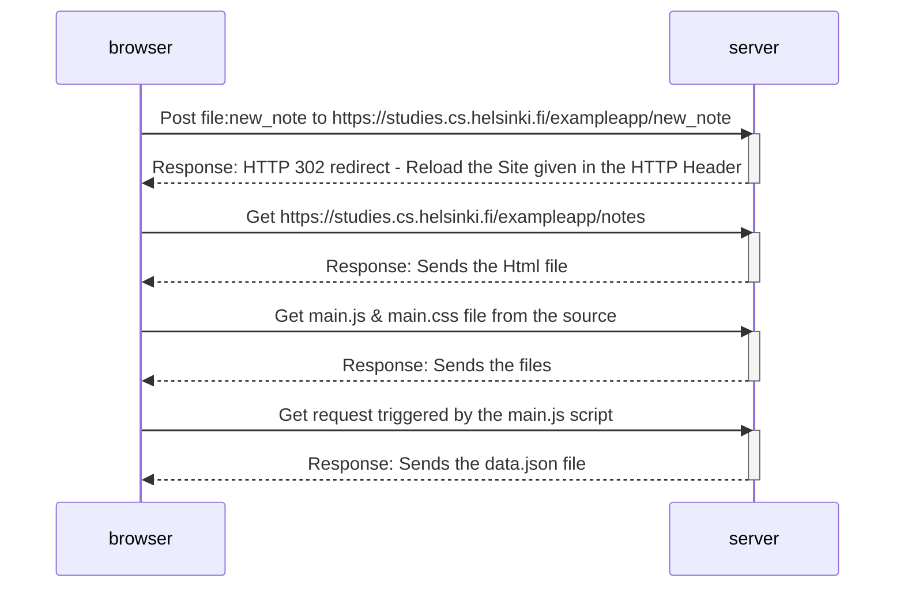

```mermaid

    sequenceDiagram
    participant browser
    participant server

    browser->>server: Post file:new_note to https://studies.cs.helsinki.fi/exampleapp/new_note
    activate server
    server-->>browser: Response: HTTP 302 redirect - Reload the Site given in the HTTP Header
    deactivate server

    browser->>server: Get https://studies.cs.helsinki.fi/exampleapp/notes
    activate server
    server-->>browser: Response: Sends the Html file
    deactivate server

    browser->>server: Get main.js & main.css file from the source
    activate server
    server-->>browser: Response: Sends the files
    deactivate server

    browser->>server: Get request triggered by the main.js script
    activate server
    server-->>browser: Response: Sends the data.json file
    deactivate server
```
