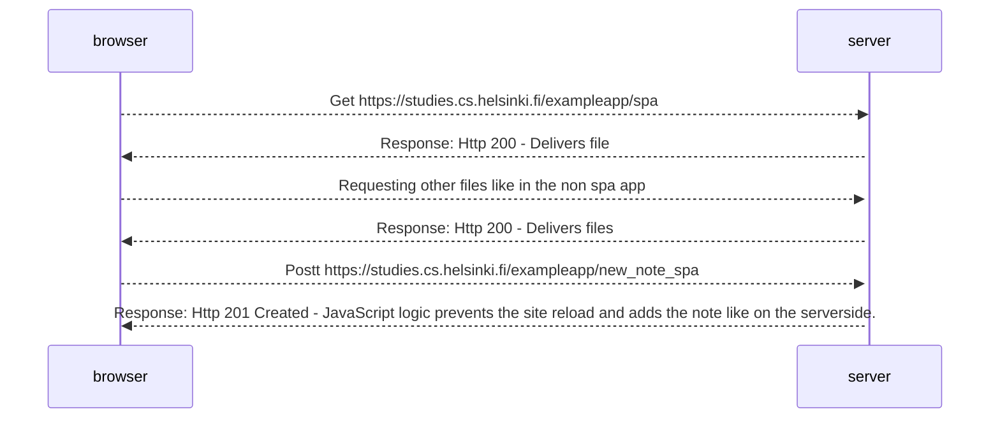

```mermaid
sequenceDiagram
    participant browser
    participant server

    browser-->>server: Get https://studies.cs.helsinki.fi/exampleapp/spa
    activate server
    server-->>browser: Response: Http 200 - Delivers file

    browser-->>server: Requesting other files like in the non spa app
    activate server
    server-->>browser: Response: Http 200 - Delivers files

    browser-->>server: Postt https://studies.cs.helsinki.fi/exampleapp/new_note_spa
    activate server
    server-->>browser: Response: Http 201 Created - JavaScript logic prevents the site reload and adds the note like on the serverside.
```
