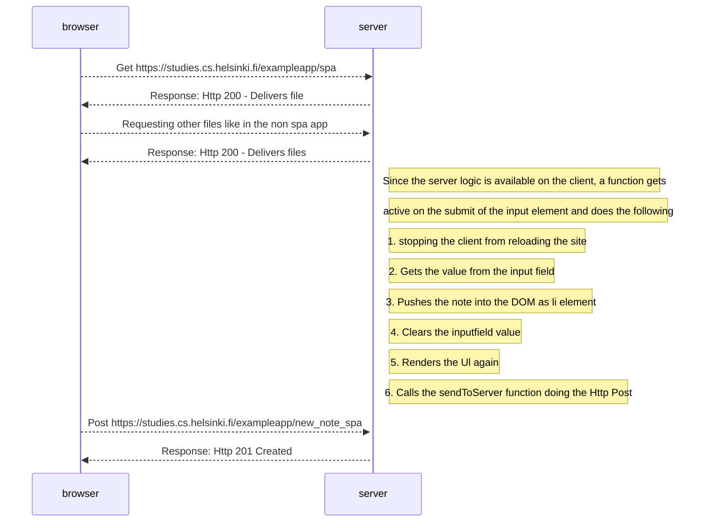

```mermaid
sequenceDiagram
    participant browser
    participant server

    browser-->>server: Get https://studies.cs.helsinki.fi/exampleapp/spa
    activate server
    server-->>browser: Response: Http 200 - Delivers file

    browser-->>server: Requesting other files like in the non spa app
    activate server
    server-->>browser: Response: Http 200 - Delivers files
    note right of server:Since the server logic is available on the client, a function gets
    note right of server:active on the submit of the input element and does the following
    note right of server:1. stopping the client from reloading the site
    note right of server:2. Gets the value from the input field
    note right of server:3. Pushes the note into the DOM as li element
    note right of server:4. Clears the inputfield value
    note right of server:5. Renders the Ul again
    note right of server:6. Calls the sendToServer function doing the Http Post
    browser-->>server: Post https://studies.cs.helsinki.fi/exampleapp/new_note_spa
    activate server
    server-->>browser: Response: Http 201 Created
```
